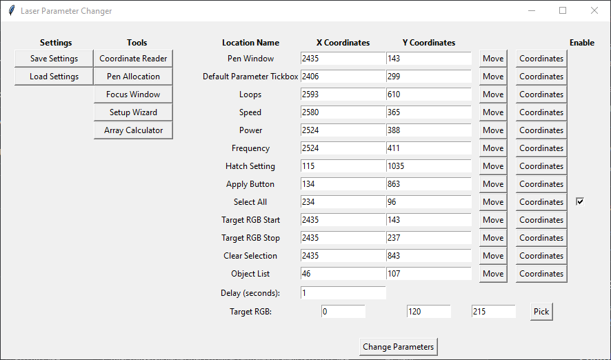

# 
<ins><strong>EZCad Parameter Switcher</strong></ins>

  

EZCad Parameter Switcher is a desktop utility developed to streamline repetitive workflows within EZCad laser marking software.

Originally created as my first desktop software project, the application was developed to reduce the time required to modify laser processing parameters across large projects. EZCad provides only limited tools for managing repetitive parameter changes, making iterative workflows both slow and error-prone.

Rather than manually updating dozens of processing parameters across multiple objects, the application automates many of the repetitive tasks involved in configuring laser marking projects, significantly reducing setup time while improving consistency.

## <ins>Features</ins>

- Batch parameter replacement across EZCad project files
- Automatic pen allocation management
- Interactive setup helper for new projects
- Bulk editing of laser processing parameters
- Import parameter sets directly from Microsoft Excel
- Configurable parameter presets
- Save and reload application settings
- Simple desktop interface for rapid operation
- Designed specifically for accelerating repetitive workflows

## <ins>Application Overview</ins>

The application provides three primary utilities that simplify common tasks when preparing EZCad projects.

### Setup Helper

https://github.com/user-attachments/assets/979e3a75-80a0-4880-a585-f71c4003db4d

The Setup Helper automates the initial configuration required by the application. Using image recognition, it locates key interface elements within the EZCad window and records their screen coordinates as points of interest.

Once the setup process has been completed, the configuration is saved and can be reused in future sessions, provided the EZCad window remains in the same position and resolution. This removes the need to manually redefine interface locations each time the application is used.

### Pen Allocation

https://github.com/user-attachments/assets/ad8afc8c-41cd-4711-b616-6e1ad2f9c344

The Pen Allocation tool simplifies the assignment of existing pen configurations to selected objects within an EZCad project.

Rather than creating new processing parameters, it provides a faster method of applying parameters that have already been configured in EZCad. Additional features include automatic hatch pen number allocation and tools for reordering objects within the project browser, making large projects significantly easier to organise and manage.

### Parameter Changer

https://github.com/user-attachments/assets/823616a0-f1f7-4b2f-afd0-2ce6e55a97be

The Parameter Changer was developed to eliminate one of the most repetitive aspects of preparing laser marking projects. When working with large parameter matrices—often containing 25 or more individual objects—manually updating each processing parameter became both time-consuming and susceptible to human error.

The tool performs bulk replacement of laser parameters throughout an EZCad project, allowing complete parameter sets to be updated in seconds while ensuring consistency across every object. This dramatically reduces project preparation time and helps prevent mistakes that can easily occur during manual editing.

## <ins>Technical Overview</ins>

The application is written in Python using Tkinter for the graphical interface.

Rather than interacting directly with the EZCad application, the software parses and modifies EZCad project files, allowing processing parameters to be updated automatically before the project is reopened.

This approach provides a lightweight and reliable method of automating repetitive configuration tasks without requiring modifications to the laser control software itself.

### Automation Approach

The application automates many interactions by simulating mouse movement and clicks within the EZCad interface. This approach allowed repetitive workflows to be automated without requiring reverse engineering of the application or direct interaction with its internal data structures.

As the automation relies on predefined screen coordinates, the EZCad window must remain in the configured position during operation, and user interaction with the mouse should be avoided until the automated sequence has completed. A future version could instead interact directly with the running EZCad process, removing these constraints and making the automation considerably more robust.

## <ins>Why This Project Exists</ins>

Many laser marking workflows involve repeatedly adjusting combinations of processing parameters such as power, speed, frequency and hatch spacing. As project complexity increases, manually updating these values across multiple objects quickly becomes tedious and increases the likelihood of mistakes.

Although EZCad provides the core functionality required to operate laser systems, many everyday productivity features are either absent or limited. Tasks such as bulk parameter editing, rapid project setup and efficient parameter management often require repetitive manual work.

This utility was developed to automate those repetitive tasks, allowing projects to be prepared more quickly while improving consistency across large parameter studies.

## <ins>Future Improvements</ins>

Potential future enhancements include:

- Modern user interface using DearPyGui.
- Direct interaction with the running EZCad process to eliminate simulated mouse and keyboard automation.
- Additional batch editing tools.

Although originally developed as a utility for EZCad, this project marked the beginning of my interest in building software to solve practical workflow problems. Many of the concepts explored here—including GUI development, file parsing and workflow automation—were later expanded upon in my subsequent desktop applications.
